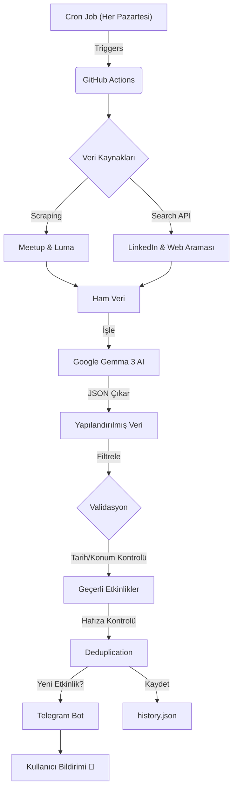

# 🤖 Tech Event AI Agent


-4285F4?logo=google&logoColor=white)


**Tech Event AI**, İstanbul'daki teknoloji, yazılım, veri bilimi ve yapay zeka etkinliklerini (Meetup, Luma, LinkedIn) tarayan, **Google Gemma 3 (27B)** yapay zeka modelini kullanarak analiz eden ve en güncel fırsatları **Telegram** üzerinden bildiren tam otomatik bir ajandır.

## 🚀 Proje Hakkında

Bu proje, dağınık halde bulunan etkinlik verilerini (web siteleri, sosyal medya postları) tek bir merkezde toplamak ve filtrelemek amacıyla geliştirilmiştir. "Set and Forget" (Kur ve Unut) mimarisiyle tasarlanan ajan, GitHub Actions üzerinde **her Pazartesi sabahı** otomatik olarak çalışır.

### ✨ Temel Özellikler

* **Hibrit Veri Toplama:** Hem doğrudan web kazıma (Scraping) hem de Arama Motoru (Tavily API) ile LinkedIn postlarını tarama.
* **LLM Destekli Analiz:** Karmaşık ve düzensiz metinlerden tarih, konum ve başlık bilgisini ayıklamak için Google'ın güçlü açık kaynak modeli **Gemma 3 (27B)** kullanılır.
* **Akıllı Filtreleme:**
    * 📍 Sadece **İstanbul** içi etkinlikleri filtreler.
    * 📅 Tarihi geçmiş veya "Online" etkinlikleri otomatik eler.
* **Hafıza Sistemi:** `history.json` dosyası sayesinde aynı etkinliği tekrar tekrar göndermez (Deduplication).
* **Otomasyon:** GitHub Actions (Cronjob) ile sunucu maliyeti olmadan periyodik çalışır.
* **Anlık Bildirim:** Sonuçları formatlı ve tıklanabilir linklerle Telegram'a gönderir.

## 🏗️ Mimari ve Akış



## 🛠️ Teknolojiler

* **Dil:** Python 3.10+
* **AI Model:** Google Gemma 3 (27B)
* **Arama & Scraping:** Tavily Search API, Jina Reader
* **Otomasyon:** GitHub Actions (CI/CD)
* **Bildirim:** Telegram Bot API
* **Veri Yönetimi:** JSON (Local Storage)

## ⚙️ Kurulum (Local)

Projeyi kendi bilgisayarınızda çalıştırmak için aşağıdaki adımları izleyin:

1. **Repoyu Klonlayın:**
```bash
git clone [https://github.com/kaant7/tech-event-ai.git](https://github.com/kaant7/tech-event-ai.git)
cd tech-event-ai

```


2. **Sanal Ortam Oluşturun:**
```bash
python -m venv venv
source venv/bin/activate  # Mac/Linux
# venv\Scripts\activate   # Windows

```


3. **Gereksinimleri Yükleyin:**
```bash
pip install -r requirements.txt

```


4. **Ortam Değişkenlerini Ayarlayın:**
`.env` adında bir dosya oluşturun ve aşağıdaki anahtarları ekleyin:
```ini
GOOGLE_API_KEY="AI_STUDIO_API_KEY"
TAVILY_API_KEY="TAVILY_API_KEY"
TELEGRAM_BOT_TOKEN="TELEGRAM_TOKEN"
TELEGRAM_CHAT_ID="TELEGRAM_CHAT_ID"

```


5. **Çalıştırın:**
```bash
python agent.py

```


## ☁️ GitHub Actions Kurulumu (Otomasyon)

Bu projeyi kendi GitHub hesabınızda otomatize etmek için:

1. Reponuzda **Settings > Secrets and variables > Actions** kısmına gidin.
2. `.env` dosyasındaki 4 anahtarı (GOOGLE_API_KEY, TAVILY_API_KEY, vb.) "New Repository Secret" olarak ekleyin.
3. **Settings > Actions > General** altından "Workflow permissions" kısmını **Read and write permissions** olarak ayarlayın.
4. Ajan artık her Pazartesi sabahı otomatik çalışacaktır.

## 🤝 Katkıda Bulunma

Hata bildirimleri ve Pull Request'ler memnuniyetle karşılanır. Büyük değişiklikler için önce bir Issue açarak tartışmanızı öneririm.

## 📝 Lisans

Bu proje [MIT License](https://www.google.com/search?q=LICENSE) altında lisanslanmıştır.

---

**Geliştirici:** [Kaan Efe Taş](https://www.google.com/search?q=https://github.com/kaant7)
*Computer Engineering Student @ Istanbul Bilgi University*
